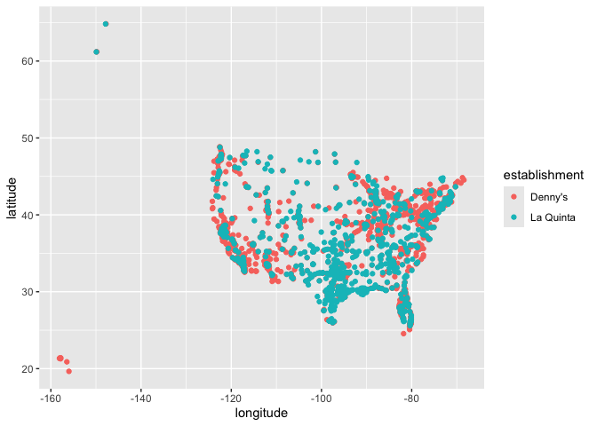
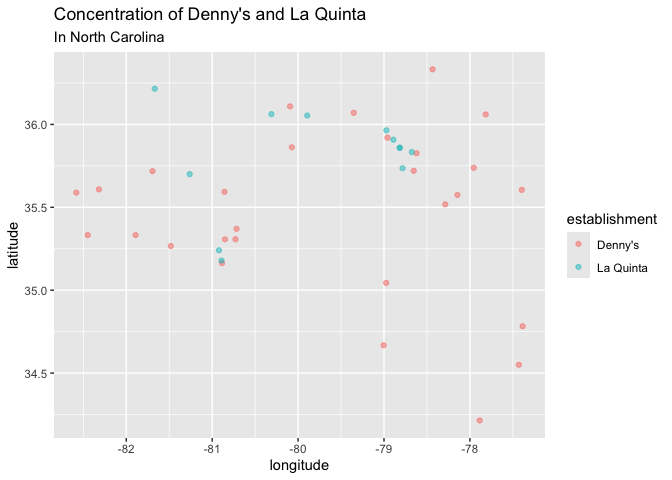
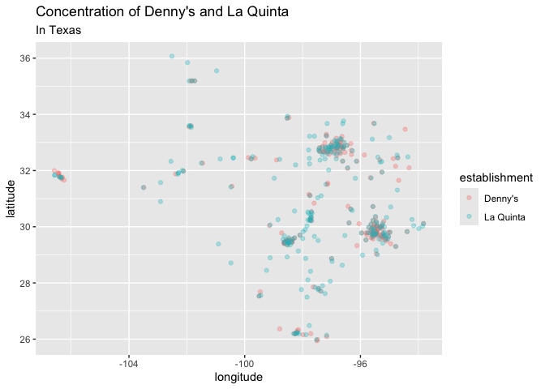

Lab 04 - La Quinta is Spanish for next to Denny’s, Pt. 1
================
Charlize Ezernack
01-31-2026

### Load packages and data

``` r
library(tidyverse) 
devtools::install_github("rstudio-education/dsbox") 
library(dsbox) 
```

``` r
states <- read_csv("data/states.csv")
```

### Exercise 1

``` r
nrow(dennys)
```

    ## [1] 1643

``` r
ncol(dennys)
```

    ## [1] 6

``` r
glimpse(dennys)
```

    ## Rows: 1,643
    ## Columns: 6
    ## $ address   <chr> "2900 Denali", "3850 Debarr Road", "1929 Airport Way", "230 …
    ## $ city      <chr> "Anchorage", "Anchorage", "Fairbanks", "Auburn", "Birmingham…
    ## $ state     <chr> "AK", "AK", "AK", "AL", "AL", "AL", "AL", "AL", "AL", "AL", …
    ## $ zip       <chr> "99503", "99508", "99701", "36849", "35207", "35294", "35056…
    ## $ longitude <dbl> -149.8767, -149.8090, -147.7600, -85.4681, -86.8317, -86.803…
    ## $ latitude  <dbl> 61.1953, 61.2097, 64.8366, 32.6033, 33.5615, 33.5007, 34.206…

The dimensions are 1643 x 6, where each row indicates a location for a
Denny’s located indicated by the following variables: address, city,
state, zip, longitude, and latitude.

### Exercise 2

``` r
nrow(laquinta)
```

    ## [1] 909

``` r
ncol(laquinta)
```

    ## [1] 6

``` r
glimpse(laquinta)
```

    ## Rows: 909
    ## Columns: 6
    ## $ address   <chr> "793 W. Bel Air Avenue", "3018 CatClaw Dr", "3501 West Lake …
    ## $ city      <chr> "\nAberdeen", "\nAbilene", "\nAbilene", "\nAcworth", "\nAda"…
    ## $ state     <chr> "MD", "TX", "TX", "GA", "OK", "TX", "AG", "TX", "NM", "NM", …
    ## $ zip       <chr> "21001", "79606", "79601", "30102", "74820", "75254", "20345…
    ## $ longitude <dbl> -76.18846, -99.77877, -99.72269, -84.65609, -96.63652, -96.8…
    ## $ latitude  <dbl> 39.52322, 32.41349, 32.49136, 34.08204, 34.78180, 32.95164, …

The dimensions are 909 x 6, where each row indicates a location for a La
Quinta hotel indicated by the following variables: address, city, state,
zip, longitude, and latitude. Remove this text, and add your answer for
Exercise 2 here. Add code chunks as needed. Don’t forget to label your
code chunk. Do not use spaces in code chunk labels.

### Exercise 3

After looking at the La Quinta website there are locations outside the
U.S in Asia, South America, the Middle East, Europe, Australia and the
Pacific Rim, and Canada.

There does not seem to be any locations outside the U.S for Denny’s.

In terms of looking at the data I believe I can try to filter for
locations that are “NA” for state for La Quinta.

### Exercise 4

In terms of looking at the data I believe I can try to filter for
locations that are “NA” for state for La Quinta.

### Exercise 5

``` r
dennys %>%
  filter(!(state %in% states$abbreviation))
```

    ## # A tibble: 0 × 6
    ## # ℹ 6 variables: address <chr>, city <chr>, state <chr>, zip <chr>,
    ## #   longitude <dbl>, latitude <dbl>

``` r
dennys %>%
  mutate(country = "United States")
```

    ## # A tibble: 1,643 × 7
    ##    address                        city    state zip   longitude latitude country
    ##    <chr>                          <chr>   <chr> <chr>     <dbl>    <dbl> <chr>  
    ##  1 2900 Denali                    Anchor… AK    99503    -150.      61.2 United…
    ##  2 3850 Debarr Road               Anchor… AK    99508    -150.      61.2 United…
    ##  3 1929 Airport Way               Fairba… AK    99701    -148.      64.8 United…
    ##  4 230 Connector Dr               Auburn  AL    36849     -85.5     32.6 United…
    ##  5 224 Daniel Payne Drive N       Birmin… AL    35207     -86.8     33.6 United…
    ##  6 900 16th St S, Commons on Gree Birmin… AL    35294     -86.8     33.5 United…
    ##  7 5931 Alabama Highway, #157     Cullman AL    35056     -86.9     34.2 United…
    ##  8 2190 Ross Clark Circle         Dothan  AL    36301     -85.4     31.2 United…
    ##  9 900 Tyson Rd                   Hope H… AL    36043     -86.4     32.2 United…
    ## 10 4874 University Drive          Huntsv… AL    35816     -86.7     34.7 United…
    ## # ℹ 1,633 more rows

### Exercise 6

``` r
dennys %>%
  mutate(country = "United States")
```

    ## # A tibble: 1,643 × 7
    ##    address                        city    state zip   longitude latitude country
    ##    <chr>                          <chr>   <chr> <chr>     <dbl>    <dbl> <chr>  
    ##  1 2900 Denali                    Anchor… AK    99503    -150.      61.2 United…
    ##  2 3850 Debarr Road               Anchor… AK    99508    -150.      61.2 United…
    ##  3 1929 Airport Way               Fairba… AK    99701    -148.      64.8 United…
    ##  4 230 Connector Dr               Auburn  AL    36849     -85.5     32.6 United…
    ##  5 224 Daniel Payne Drive N       Birmin… AL    35207     -86.8     33.6 United…
    ##  6 900 16th St S, Commons on Gree Birmin… AL    35294     -86.8     33.5 United…
    ##  7 5931 Alabama Highway, #157     Cullman AL    35056     -86.9     34.2 United…
    ##  8 2190 Ross Clark Circle         Dothan  AL    36301     -85.4     31.2 United…
    ##  9 900 Tyson Rd                   Hope H… AL    36043     -86.4     32.2 United…
    ## 10 4874 University Drive          Huntsv… AL    35816     -86.7     34.7 United…
    ## # ℹ 1,633 more rows

### Exercise 7

There are locations in Canada, Mexico, China, New Zealand, Georgia,
Turkiye, United Arab Emirates, Colombia, and Ecudaor.

### Exercise 8

``` r
laquinta %>%
  filter(!(state %in% states$abbreviation))
```

    ## # A tibble: 14 × 6
    ##    address                                  city  state zip   longitude latitude
    ##    <chr>                                    <chr> <chr> <chr>     <dbl>    <dbl>
    ##  1 Carretera Panamericana Sur KM 12         "\nA… AG    20345    -102.     21.8 
    ##  2 Av. Tulum Mza. 14 S.M. 4 Lote 2          "\nC… QR    77500     -86.8    21.2 
    ##  3 Ejercito Nacional 8211                   "Col… CH    32528    -106.     31.7 
    ##  4 Blvd. Aeropuerto 4001                    "Par… NL    66600    -100.     25.8 
    ##  5 Carrera 38 # 26-13 Avenida las Palmas c… "\nM… ANT   0500…     -75.6     6.22
    ##  6 AV. PINO SUAREZ No. 1001                 "Col… NL    64000    -100.     25.7 
    ##  7 Av. Fidel Velazquez #3000 Col. Central   "\nM… NL    64190    -100.     25.7 
    ##  8 63 King Street East                      "\nO… ON    L1H1…     -78.9    43.9 
    ##  9 Calle Las Torres-1 Colonia Reforma       "\nP… VE    93210     -97.4    20.6 
    ## 10 Blvd. Audi N. 3 Ciudad Modelo            "\nS… PU    75010     -97.8    19.2 
    ## 11 Ave. Zeta del Cochero No 407             "Col… PU    72810     -98.2    19.0 
    ## 12 Av. Benito Juarez 1230 B (Carretera 57)… "\nS… SL    78399    -101.     22.1 
    ## 13 Blvd. Fuerza Armadas                     "con… FM    11101     -87.2    14.1 
    ## 14 8640 Alexandra Rd                        "\nR… BC    V6X1…    -123.     49.2

``` r
laquinta <- laquinta %>%
  mutate(country = case_when(
    state %in% state.abb ~ "United States",
    state %in% c("ON", "BC") ~ "Canada",
    state == "ANT" ~ "Colombia",
     state %in% c("AG", "QR","CH", "PU", "NL", "VE", "SL" ) ~ "Mexico", state %in% c("ON", "BC") ~ "China"
  ))
```

### Exercise 9

``` r
laquinta <- laquinta %>%
  filter(country == "United States")

dennys %>% count(state)
```

    ## # A tibble: 51 × 2
    ##    state     n
    ##    <chr> <int>
    ##  1 AK        3
    ##  2 AL        7
    ##  3 AR        9
    ##  4 AZ       83
    ##  5 CA      403
    ##  6 CO       29
    ##  7 CT       12
    ##  8 DC        2
    ##  9 DE        1
    ## 10 FL      140
    ## # ℹ 41 more rows

``` r
laquinta %>% count (state)
```

    ## # A tibble: 48 × 2
    ##    state     n
    ##    <chr> <int>
    ##  1 AK        2
    ##  2 AL       16
    ##  3 AR       13
    ##  4 AZ       18
    ##  5 CA       56
    ##  6 CO       27
    ##  7 CT        6
    ##  8 FL       74
    ##  9 GA       41
    ## 10 IA        4
    ## # ℹ 38 more rows

California has the most Denny’s locations at 403, and Texas trails
slightly behind with 200. The states with low amounts of Denny’s have 3
restaurants, the states are South Dakota, West Virginia, New Hampshire,
Arkansas.  
Delaware has the lowest amount at 1 location.

Texas has the most La Quinta locations by far at 237. Maine has the
lowest amount of locations with only 1.

I do not find this super surprising since I would assume popular tourist
spots to have more locations of both La Quinta and Denny’s.

### Exercise 10

``` r
dennys %>%
  count(state) %>%
  inner_join(states, by = c("state" = "abbreviation")) %>%
  mutate(dennysarea = (n/area) * 1000) %>%
  arrange(desc(dennysarea)) %>% select(state, n, dennysarea)
```

    ## # A tibble: 51 × 3
    ##    state     n dennysarea
    ##    <chr> <int>      <dbl>
    ##  1 DC        2     29.3  
    ##  2 RI        5      3.24 
    ##  3 CA      403      2.46 
    ##  4 CT       12      2.16 
    ##  5 FL      140      2.13 
    ##  6 MD       26      2.10 
    ##  7 NJ       10      1.15 
    ##  8 NY       56      1.03 
    ##  9 IN       37      1.02 
    ## 10 OH       44      0.982
    ## # ℹ 41 more rows

``` r
laquinta %>% 
  count(state) %>%
  inner_join(states, by = c("state" = "abbreviation")) %>%
  mutate(quintaarea = (n/area) * 1000) %>%
  arrange(desc(quintaarea)) %>% select(state, n, quintaarea)
```

    ## # A tibble: 48 × 3
    ##    state     n quintaarea
    ##    <chr> <int>      <dbl>
    ##  1 RI        2      1.29 
    ##  2 FL       74      1.13 
    ##  3 CT        6      1.08 
    ##  4 MD       13      1.05 
    ##  5 TX      237      0.882
    ##  6 TN       30      0.712
    ##  7 GA       41      0.690
    ##  8 NJ        5      0.573
    ##  9 MA        6      0.568
    ## 10 LA       28      0.535
    ## # ℹ 38 more rows

<!--put answers for #10, do area/n and then add it to a new variable to answer square miles question -->

D.C, Rhode Island, and California are the top 3 states for most Denny’s
location per thousand square miles, and Rhode Island, Florida, and
Connecticut are the top 3 states for most La Quinta locations per
thousand square miles.

### Exercise 11

``` r
dennys <- dennys %>%
  mutate(establishment = "Denny's")
  
laquinta <- laquinta %>%
  mutate(establishment = "La Quinta")
  
dn_lq <- bind_rows(dennys, laquinta)

ggplot(dn_lq, mapping = aes(
  x = longitude,
  y = latitude,
  color = establishment
)) +
  geom_point()
```

<!-- -->
\### Exercise 12

``` r
data1 <- dn_lq %>% filter(state == "NC")

ggplot(data1, mapping = aes(
  x = longitude,
  y = latitude,
  color = establishment
)) + labs(title = "Concentration of Denny's and La Quinta", subtitle = "In North Carolina") +
  geom_point(alpha= .5)
```

<!-- -->

Yes the joke slightly holds here because every La Quinta is super close
to a Denny’s, shown by the blue and pink dots overlapping often.

### Exercise 13

``` r
data2 <- dn_lq %>% filter(state == "TX")

ggplot(data2, mapping = aes(
  x = longitude,
  y = latitude,
  color = establishment
)) + labs(title = "Concentration of Denny's and La Quinta", subtitle = "In Texas") +
  geom_point(alpha = .3)
```

<!-- -->

Yes, the joke absolutely holds here. There are many clusters of pink and
blue, depicting high concentration of both establishments in the same
area.
